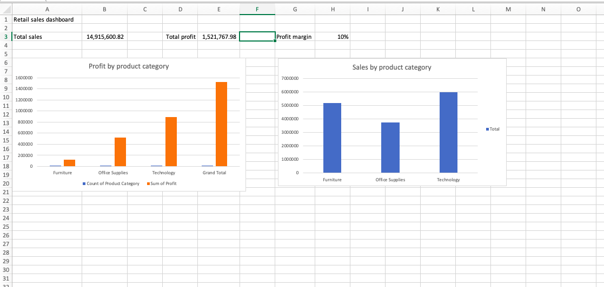

# Retail Sales Analysis

## Project Overview

This project analyses retail sales data to identify sales performance, profitability, loss-making products, and other business insights.

The analysis was completed using Excel and SQL, with an interactive Excel dashboard created to present key findings.

## Tools Used

- Microsoft Excel
- SQL
- PivotTables and PivotCharts
- GitHub


## Key Findings

- Total sales were approximately 14.92 million.
- Total profit was approximately 1.52 million.
- Technology generated the highest total profit among the three product categories.
- Furniture generated substantial sales but considerably lower profit than Technology.
- Tables and Bookcases were the two loss-making product sub-categories.
- Several individual products generated significant negative profit and should be investigated further.
- Average discounts were relatively similar across most product sub-categories, so discount alone did not explain the observed losses.

## Project Structure

```text
retail-sales-analysis/
├── excel/
│   └── retail_sales_analysis.xlsx
├── sql/
│   └── analysis.sql
└── README.md
```


## Dashboard



The Excel dashboard presents key sales and profitability metrics, including:

- Total Sales
- Total Profit
- Profit Margin
- Sales by Product Category
- Profit by Product Category

## Skills Demonstrated

- Data cleaning and validation
- Excel data analysis
- PivotTables and PivotCharts
- Business KPI analysis
- Profitability analysis
- SQL aggregation and filtering
- GROUP BY and HAVING
- Data visualisation
- Business insight generation
- GitHub project management
